# Distilling Models

## Distillation Explained

Distillation allows us to 
- use a larger 'teacher' model
- to train a smaller 'student' model
- student model learns from the teacher model and can achieve pretty good performance (pretty close to teacher model)

Since student model is much smaller than teacher model, it is 
- faster (uses lower resources)
- cheaper 
- still gives out good performance

<kbd>

</kbd>

## Exercise: Distillation example

[Checkout this distillation example](../../distillation/distillation-1/)